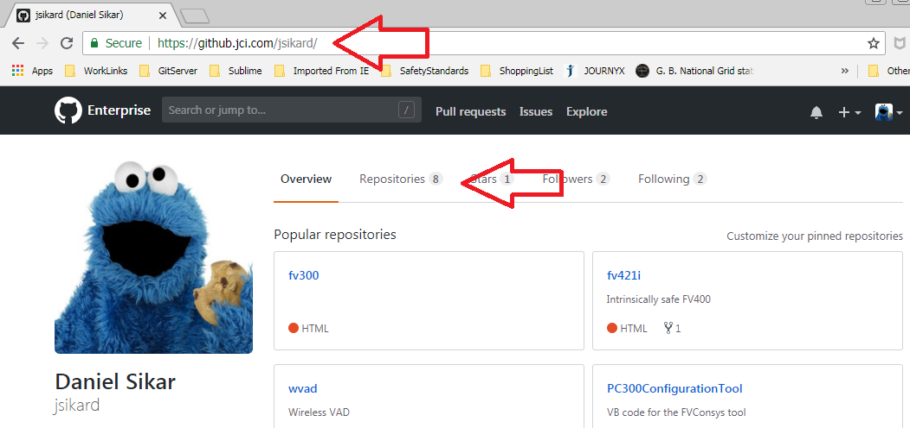
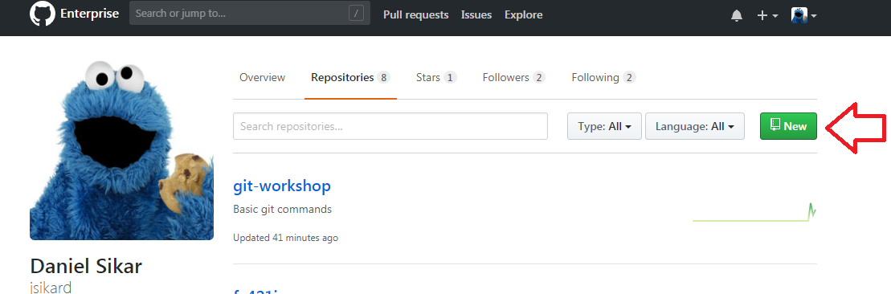
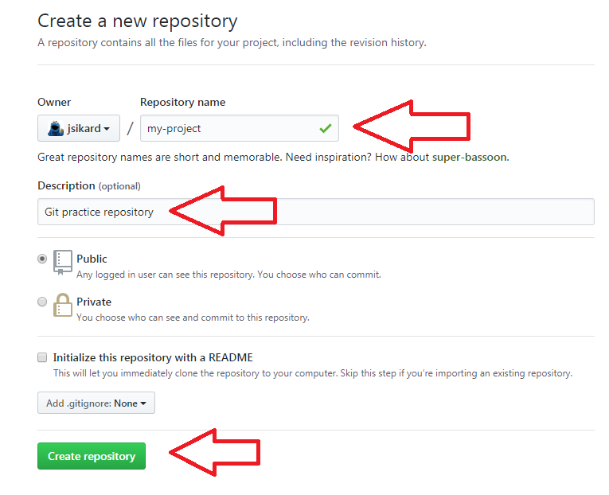
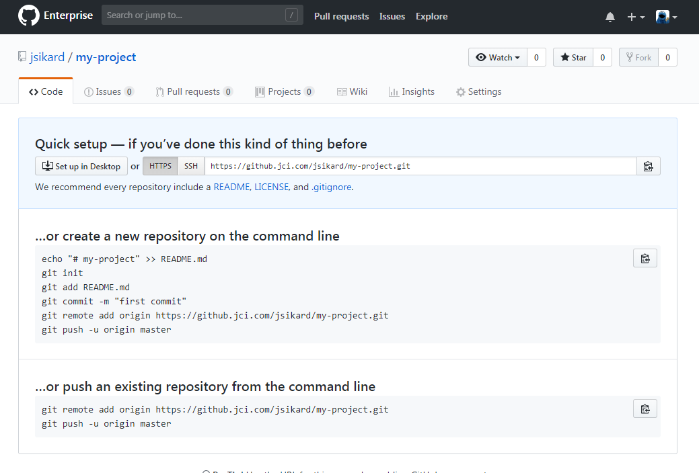
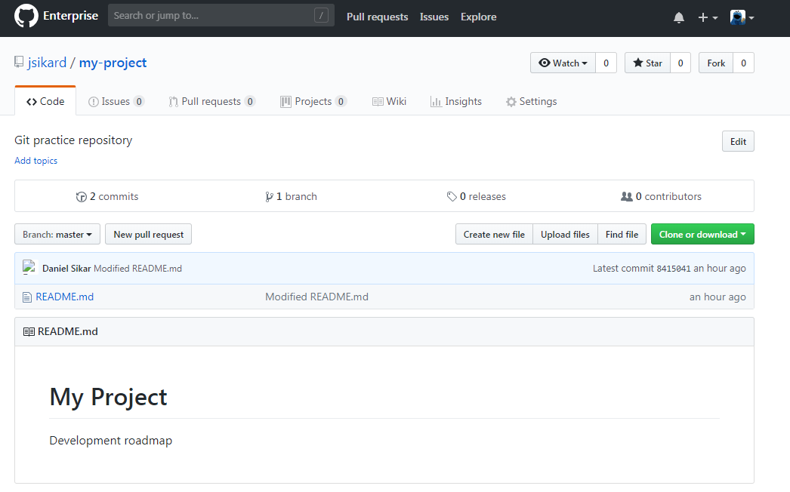
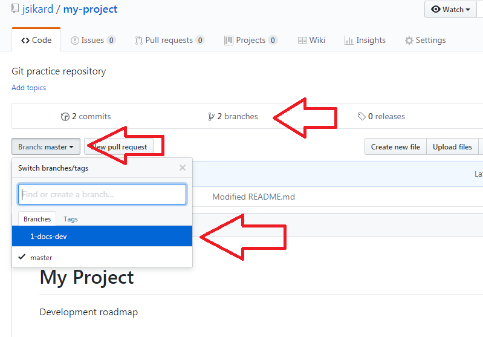

# LAB 3

## Initialising, branching, diffing, merging, fetching, pulling and pushing

### 1. Initialise a repository. Open Git-Bash, navigate to your jci-git directory and initialise a repository - git init

```
$ cd ~/Documents/jci-git
$ git init my-project
```

**Autocomplete productivity tip** - when typing a command that includes a filename or path, as soon as the reference is unambiguous, the command can be autocompleted with the tab key.  

For example, by typing

```
$ cd ~/Doc
```

Then the tab key, the path autocompletes to
```
$ cd ~/Documents
```
as long as there are not other directories or files in the same level that being with **Doc**

### 2. Add a README.md file (Modify)
```
$ cd my-project
$ echo "# My Project" > README.md
```

### 3. Verify file with concatenate command - **cat** 
```
$ cat README.MD
```

### 4. Add file to stating area - **git add** (Stage modifications)
```
$ git add README.md
```

### 5. Verify status - **git status**
```
$ git status
On branch master

No commits yet

Changes to be committed:
  (use "git rm --cached <file>..." to unstage)

        new file:   README.md
```

### 6. Commit using message switch **-m** to add a message - **git commit** (Commit modifications)
```
$ git commit -m "Initial commit -m"
[master (root-commit) 0578e2f] Initial commit.
 1 file changed, 1 insertion(+)
 create mode 100644 README.md
```

### 7. Verify status - **git status**
```
$ git status
On branch master
nothing to commit, working tree clean
```

### 8. Create and checkout a development branch with **-b** switch - **git checkout**
```
$ git checkout -b 1-docs-dev
Switched to a new branch '1-docs-dev'
```

### 9. Make changes (Modify)
```
$ echo "
Development roadmap" >> README.md
```

### 10. Verify file
```
$ cat README.md
# My Project
Development roadmap
```
### 11. Verify status - **git status**
```
$ git status
On branch 1-docs-dev
Changes not staged for commit:
  (use "git add <file>..." to update what will be committed)
  (use "git checkout -- <file>..." to discard changes in working directory)

        modified:   README.md

no changes added to commit (use "git add" and/or "git commit -a")
```

### 12. Another way of checking what files have changed using git diff and the --name-only switch
```
$ git diff --name-only
warning: LF will be replaced by CRLF in README.md.
The file will have its original line endings in your working directory.
README.md
```

### 13. Check what has changed (differences) in the file - **git diff**
```
$ git diff README.md
warning: LF will be replaced by CRLF in README.md.
The file will have its original line endings in your working directory.
diff --git a/README.md b/README.md
index a2beefd..8ab96a0 100644
--- a/README.md
+++ b/README.md
@@ -1 +1,3 @@
 # My Project
+
+Development roadmap
```

### 14. Add - **git add** (Stage)
Notice autocomplete feature may be used.  
```
$ git add README.md
warning: LF will be replaced by CRLF in README.md.
The file will have its original line endings in your working directory.
```

### 15. Check status - **git status**
```
$ git status
On branch 1-docs-dev
Changes to be committed:
  (use "git reset HEAD <file>..." to unstage)

        modified:   README.md
```

### 16. Commit changes - **git commit** (Commit)
```
$ git commit -m "Modified README.md"
[1-docs-dev 8415041] Modified README.md
 1 file changed, 2 insertions(+)
```

### 17. Verify status - **git status**
```
$ git status
On branch 1-docs-dev
nothing to commit, working tree clean
```

### 18. Verify log - **git log**
```
$ git log
commit 8415041d11993b0cd3647766f7ec6c5051f8debe (HEAD -> 1-docs-dev)
Author: Daniel Sikar <jsikard@jci.com>
Date:   Thu Aug 23 08:36:03 2018 +0100

    Modified README.md

commit 0578e2fc74f9e9346d42ecec52ec496f96e4fef1 (master)
Author: Daniel Sikar <jsikard@jci.com>
Date:   Tue Aug 21 09:51:05 2018 +0100

    Initial commit.
```

### 19. Verify differences between commits using commit hashes and HEAD notation - **git diff** 
#### 19.1 Using hashes  
```
$ git diff 0578e 84150
diff --git a/README.md b/README.md
index a2beefd..8ab96a0 100644
--- a/README.md
+++ b/README.md
@@ -1 +1,3 @@
 # My Project
+
+Development roadmap
```
#### 19.2 Using HEAD notation  
```
$ git diff HEAD~1 HEAD
diff --git a/README.md b/README.md
index a2beefd..8ab96a0 100644
--- a/README.md
+++ b/README.md
@@ -1 +1,3 @@
 # My Project
+
+Development roadmap
```
#### 19.3 Verify changed file names using hashes  
```
$ git diff --name-only 0578e 84150
README.md
```
#### 19.4 Check different file names using HEAD notation      
```
$ git diff --name-only HEAD~1 HEAD
README.md
```

### 20. Checkout master branch - **git checkout**
```
jsikard@LON2WKD079 MINGW64 ~/Documents/jci-git/my-project (1-docs-dev)
$ git checkout master
Switched to branch 'master'

jsikard@LON2WKD079 MINGW64 ~/Documents/jci-git/my-project (master)
$
```

### 21. Verify master branch README.md 

```
$ cat README.md
# My Project
```

### 22. Verify branches - **git branch**
```
$ git branch
  1-docs-dev
* master
```

### 23. Verify what files have changed between two branches - use autocomplete for branch names  
```
$ git diff --name-only master 1-docs-dev
README.md
```

### 24. Verify what has changed in a file between two branches - use up arrow to recall previous command and autocomplete for file names  
```
$ git diff master:README.md 1-docs-dev:README.md
 diff --git a/README.md b/README.md
 index a2beefd..8ab96a0 100644
 --- a/README.md
 +++ b/README.md
 @@ -1 +1,3 @@
 # My Project
 +
 +Development roadmap
```

### 25. Merge branches - **git merge** 
Use autocomplete for branch name 
```
$ git merge 1-docs-dev
Updating 0578e2f..8415041
Fast-forward
 README.md | 2 ++
 1 file changed, 2 insertions(+)
```

### 26. View logs - **git log**
```
$ git log
commit 8415041d11993b0cd3647766f7ec6c5051f8debe (HEAD -> master, 1-docs-dev)
Author: Daniel Sikar <jsikard@jci.com>
Date:   Thu Aug 23 08:36:03 2018 +0100

    Modified README.md

commit 0578e2fc74f9e9346d42ecec52ec496f96e4fef1
Author: Daniel Sikar <jsikard@jci.com>
Date:   Tue Aug 21 09:51:05 2018 +0100

    Initial commit.
```

### 27. View README.md - use autocomplete
```
$ cat README.md
# My Project

Development roadmap
```

### 28. Moving a repository around the filesystem

#### 28.1 Change directory - up one level
```
$ cd ..
```
#### 28.2 Move my-project directory - use autocomplete twice for directory names, adding **-moved** suffix to second argument
```
$ mv my-project my-project-moved
```
#### 28.3 Change directory - use autocomplete for directory name
```
$ cd my-project-moved/
```
#### 28.4 List directory contents with switches -last noticing .git directory (the git database) - **ls -last**
```
$ ls -last
total 9
4 drwxr-xr-x 1 jsikard 1049089  0 Aug 23 09:09 ../
4 drwxr-xr-x 1 jsikard 1049089  0 Aug 23 09:00 .git/
1 -rw-r--r-- 1 jsikard 1049089 37 Aug 23 09:00 README.md
0 drwxr-xr-x 1 jsikard 1049089  0 Aug 23 09:00 ./
```
### 29. Move back! Using cd and mv commands, up arrow to recall previously typed commands and/or autocomplete
```
$ cd ..
$ mv my-project-moved my-project
$ cd my-project
```

### 30. Adding a remote - **git remote add**
Notice format ```https://<username>@github.jci.com/<username>/my-project.git```
```
$ git remote add origin https://jsikard@github.jci.com/jsikard/my-project.git
```

### 31. Verify remote with -v verbose switch - **git remote**
```
$ git remote -v
origin  https://jsikard@github.jci.com/jsikard/my-project.git (fetch)
origin  https://jsikard@github.jci.com/jsikard/my-project.git (push)
```
### 32. Push branches to remote (git push) noticing error - **git push**
```
$ git push
fatal: The current branch master has no upstream branch.
To push the current branch and set the remote as upstream, use

    git push --set-upstream origin master
```

### 33. Setting upstream branch noticing error - **--set-upstream** 

```
$ git push --set-upstream origin master -- notice error

remote: Repository not found.
fatal: repository 'https://jsikard@github.jci.com/jsikard/my-project.git/' not found
```

### 34. Creating repository manually on jci github

#### 34.1 Visit ```https://github.jci.com/<your username>``` and click **Repositories**


#### 34.2 Add new repository


#### 34.3 Create repository
  
#### 34.4 Assert you see a similar page as depicted


### 35. Push master branch to remote - **git push**
```
$ git push --set-upstream origin master
Enumerating objects: 6, done.
Counting objects: 100% (6/6), done.
Delta compression using up to 8 threads.
Compressing objects: 100% (2/2), done.
Writing objects: 100% (6/6), 479 bytes | 159.00 KiB/s, done.
Total 6 (delta 0), reused 0 (delta 0)
To https://github.jci.com/jsikard/my-project.git
 * [new branch]      master -> master
Branch 'master' set up to track remote branch 'master' from 'origin'.
```

### 36. Verify repository has been updated (Refresh arrow on browser or CTRL + F5 on keyboard)


### 37. Push 1-docs-dev development branch to remote

#### 37.1 Checkout branch - **git checkout** use autocomplete
```
$ git checkout 1-docs-dev
Switched to branch '1-docs-dev'
```
#### 37.2 Push - notice error
```
$ git push
fatal: The current branch 1-docs-dev has no upstream branch.
To push the current branch and set the remote as upstream, use

    git push --set-upstream origin 1-docs-dev
```

#### 37.3 Set upstream
```
$ git push --set-upstream origin 1-docs-dev
Total 0 (delta 0), reused 0 (delta 0)
To https://github.jci.com/jsikard/my-project.git
 * [new branch]      1-docs-dev -> 1-docs-dev
Branch '1-docs-dev' set up to track remote branch '1-docs-dev' from 'origin'.
```

#### 37.4 Check remote branches with **-r** switch
```
$ git branch -r
  origin/1-docs-dev
  origin/master
```
### 38. Verify branches on JCI Github (CTRL + F5 to refresh browser)


